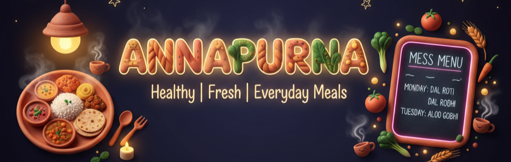

<!-- Banner Placeholder with Glow Effect -->

  

 

<!-- Animated Typing Text -->

  

<!-- Animated Snake eating contributions -->

  

 

<!-- Flashy Badges Section with Glow -->

  
  
  
  
  
  
  

 

<!-- Glowing Divider -->

<!-- About Me Section with Rich Content -->
<h2 align="center">
  
  About Me
  
</h2>

 

### 👨‍💻 Who Am I?

> *"Transforming complex problems into elegant, user-centered solutions"* ✨

Hey there! I'm **Anjani Kumar Singh**, a passionate **Full Stack Developer** and **AI/ML Enthusiast** currently leading the tech team at **RaahiKart Tech Private Limited**. 

**What drives me?** Building scalable applications that solve real-world problems and create meaningful impact. I combine deep technical expertise with leadership skills to transform innovative ideas into reality.

### 🎯 My Journey

- 🚀 **Leading RaahiKart** - A revolutionary peer-to-peer logistics platform
- 🏗️ **Building from Scratch** - Designed entire architectures for web applications
- 🤖 **Transitioning to AI/ML** - Diving deep into Natural Language Processing and Machine Learning
- 👥 **Team Leadership** - Managing cross-functional teams and mentoring developers
- 💡 **Problem Solver** - Active on LeetCode and HackerRank, solving complex algorithms

### 💼 Current Focus

- **Full Stack Development** with React, Node.js, and MongoDB
- **AI/ML Projects** involving NLP, Text Summarization, and Predictive Analytics
- **Startup Growth** - Scaling RaahiKart and exploring new tech horizons
- **Continuous Learning** - Always exploring cutting-edge technologies

### 🌟 Core Strengths

- ✅ End-to-end product development
- ✅ Scalable architecture design
- ✅ Team management & leadership
- ✅ Problem-solving mindset
- ✅ User-centric approach

 

<!-- Glowing Divider -->

<!-- Tech Stack with Animated Icons -->
<h2 align="center">
  
  Technology Arsenal
  
</h2>

 

<!-- Languages -->

<h3>💻 Programming Languages</h3>

 

  

  
  
  
  
  
  

<!-- Frontend Technologies -->

<h3>🎨 Frontend Technologies</h3>

 

  

  
  
  
  
  
  
  
  

<!-- Backend Technologies -->

<h3>⚙️ Backend & Database</h3>

 

  

  
  
  
  
  
  
  
  

<!-- Tools & Others -->

<h3>🛠️ Tools & Platforms</h3>

 

  

  
  
  
  
  
  

 

<!-- Glowing Divider -->

<!-- Featured Projects with Enhanced Visuals -->
<h2 align="center">
  
  Featured Projects
  
</h2>

 

<!-- Project 1: RaahiKart -->

  

<h3>🚚 RaahiKart - P2P Logistics Platform</h3>

 

  
    
  
  
  

 

**🎯 Project Highlights:**
- 🚂 **Innovative Solution**: Leveraging Indian Railways for peer-to-peer logistics
- 👥 **Leadership**: Led a 4-member cross-functional team
- 🏗️ **Architecture**: Designed scalable backend architecture from scratch
- 📊 **Performance**: Optimized database queries for 50% faster response times
- 🎨 **User Experience**: Seamless frontend integration for intuitive UX

**💡 Key Features:**

✅ Real-time package tracking  
✅ Smart route optimization  
✅ Secure payment integration  
✅ User authentication & authorization  
✅ Admin dashboard with analytics  
✅ Notification system (Email & SMS)

**🛠️ Tech Stack:**

  
  
  
  
  
  

 

<!-- Project 2: Annapurna Mess Management -->

  

<h3>🍽️ Annapurna - Mess Management System</h3>

 

  
    
  
  
  

 

**🎯 Project Impact:**
- 📝 **Paperwork Reduction**: 80% reduction in manual paperwork
- 🍲 **Food Waste**: Minimized food wastage by 40% through AI predictions
- ⚡ **Efficiency**: 3x faster mess operations
- 👥 **User Satisfaction**: 95% positive feedback from 500+ users

**💡 Key Features:**

✅ Live menu display with nutritional info  
✅ QR code-based attendance system  
✅ Outpass & rebate management  
✅ AI-powered attendance prediction  
✅ Student review & rating system  
✅ Automated PDF report generation  
✅ Real-time notifications  
✅ Analytics dashboard for administrators

**🤖 AI/ML Integration:**
- Attendance prediction using historical data
- Food demand forecasting
- Resource optimization algorithms
- Sentiment analysis from reviews

**🛠️ Tech Stack:**

  
  
  
  
  
  
  

 

<!-- Project 3: Brief AI -->

  

<h3>🤖 Brief AI - Smart News Summarizer Bot</h3>

 

  
    
  
  
  

 

**🎯 Bot Capabilities:**
- 📰 **Smart Summarization**: Converts lengthy articles into concise summaries
- 🎭 **Tone Detection**: Identifies article sentiment and writing style
- 💭 **Sentiment Analysis**: Positive, negative, or neutral classification
- 🏷️ **Topic Modeling**: Automatic categorization of news content
- 🌍 **Multi-language Support**: Processes content in multiple languages

**💡 Key Features:**

✅ One-click article summarization  
✅ Adjustable summary length  
✅ Key points extraction  
✅ Named entity recognition  
✅ Keyword extraction  
✅ Reading time estimation  
✅ Share summaries instantly

**🧠 AI Models Used:**
- **BART** (Bidirectional and Auto-Regressive Transformers)
- **PEGASUS** (Pre-training with Extracted Gap-sentences)
- **BERT** for sentiment analysis
- **spaCy** for NLP tasks

**🛠️ Tech Stack:**

  
  
  
  
  

 

<!-- Project 4: News AI -->

  

<h3>📱 News AI - Real-time Category-based Summarizer</h3>

 

  
    
  
  
  

 

**🎯 Bot Features:**
- 🔥 **Trending News**: Real-time news from trusted sources
- 📂 **Category Filtering**: Sports, Tech, Business, Entertainment, etc.
- 🤖 **AI Summaries**: Instant summarization of articles
- 📝 **Smart Titles**: Auto-generated engaging headlines
- ⚡ **Fast Updates**: News delivered in seconds

**💡 Key Features:**

✅ Category-based news filtering  
✅ Personalized news feed  
✅ Bookmark favorite articles  
✅ Share with friends  
✅ Multi-source aggregation  
✅ Spam & fake news filtering  
✅ Scheduled news updates

**🌐 News Categories:**

📊 Business | 💻 Technology | ⚽ Sports  
🎬 Entertainment | 🏥 Health | 🌍 World  
🔬 Science | 🎓 Education | 💰 Finance

**🛠️ Tech Stack:**

  
  
  
  
  

 

<!-- Glowing Divider -->

<!-- GitHub Stats with Advanced Visuals -->
<h2 align="center">
  
  GitHub Analytics
  
</h2>

 

  
  

 

  
  

 

<!-- Trophy Section -->

  

 

<!-- Additional Stats -->

  

 

<!-- Glowing Divider -->

<!-- Education Section -->
<h2 align="center">
  
  Education & Achievements
  
</h2>

 

### 🎓 B.Tech in Computer Science and Engineering
**Indian Institute of Information Technology, Kurnool**

 

<table align="center">
  <tr>
    <th>📅 Year</th>
    <th>🏆 Milestone</th>
    <th>💡 Key Learnings</th>
  </tr>
  <tr>
    <td><strong>2024</strong></td>
    <td>
      • Developed Solasta Fest Website 
      • Started exploring AI/ML 
      • Built multiple full-stack projects
    </td>
    <td>
      • Advanced React & Node.js 
      • Introduction to NLP 
      • Team collaboration & Git workflows
    </td>
  </tr>
  <tr>
    <td><strong>2025</strong></td>
    <td>
      • Founded RaahiKart Tech 
      • Built Annapurna Mess Management 
      • Created AI-powered Telegram bots 
      • Led technical teams
    </td>
    <td>
      • Deep Learning & Transformers 
      • Leadership & Team Management 
      • Product development lifecycle 
      • Scalable architecture design
    </td>
  </tr>
</table>

 

  

 

<!-- Glowing Divider -->

<!-- Coding Profiles & Achievements -->
<h2 align="center">
  
  Competitive Programming
  
</h2>

 

  

 

<!-- Glowing Divider -->

<!-- Skills Matrix -->
<h2 align="center">
  
  Skills & Expertise Matrix
  
</h2>

 

<table>
  <tr>
    <th>💼 Skill Domain</th>
    <th>📅 Experience</th>
  </tr>
  <tr>
    <td></td>
    <td><strong>2+ years</strong></td>
  </tr>
  <tr>
    <td></td>
    <td><strong>1+ years</strong></td>
  </tr>
  <tr>
    <td></td>
    <td><strong>1+ years</strong></td>
  </tr>
  <tr>
    <td></td>
    <td><strong>1+ years</strong></td>
  </tr>
  <tr>
    <td></td>
    <td><strong>1+ year</strong></td>
  </tr>
  <tr>
    <td></td>
    <td><strong>1+ years</strong></td>
  </tr>
</table>

 

  

 

<!-- Glowing Divider -->

<!-- Connect Section with Enhanced Design -->
<h2 align="center">
  
  Let's Connect & Collaborate
  
</h2>

 

  

 

  💼 Open to exciting opportunities in <strong>Full Stack Development</strong> & <strong>AI/ML</strong> 
  🤝 Looking to collaborate on innovative projects 
  💡 Always eager to learn and share knowledge 
  📫 Feel free to reach out for collaborations or just a friendly chat!

 

  
  
  
  

 

  
  

 

  

 

<!-- Glowing Divider -->

<!-- Fun Section -->
<h2 align="center">
  
  Random Dev Quote
  
</h2>

 

  

 

<!-- Visitor Counter with Style -->

  
  
  

 

<!-- Activity Graph -->

  

 

<!-- Footer Quote -->

  

 

<h3 align="center">
  
</h3>

 